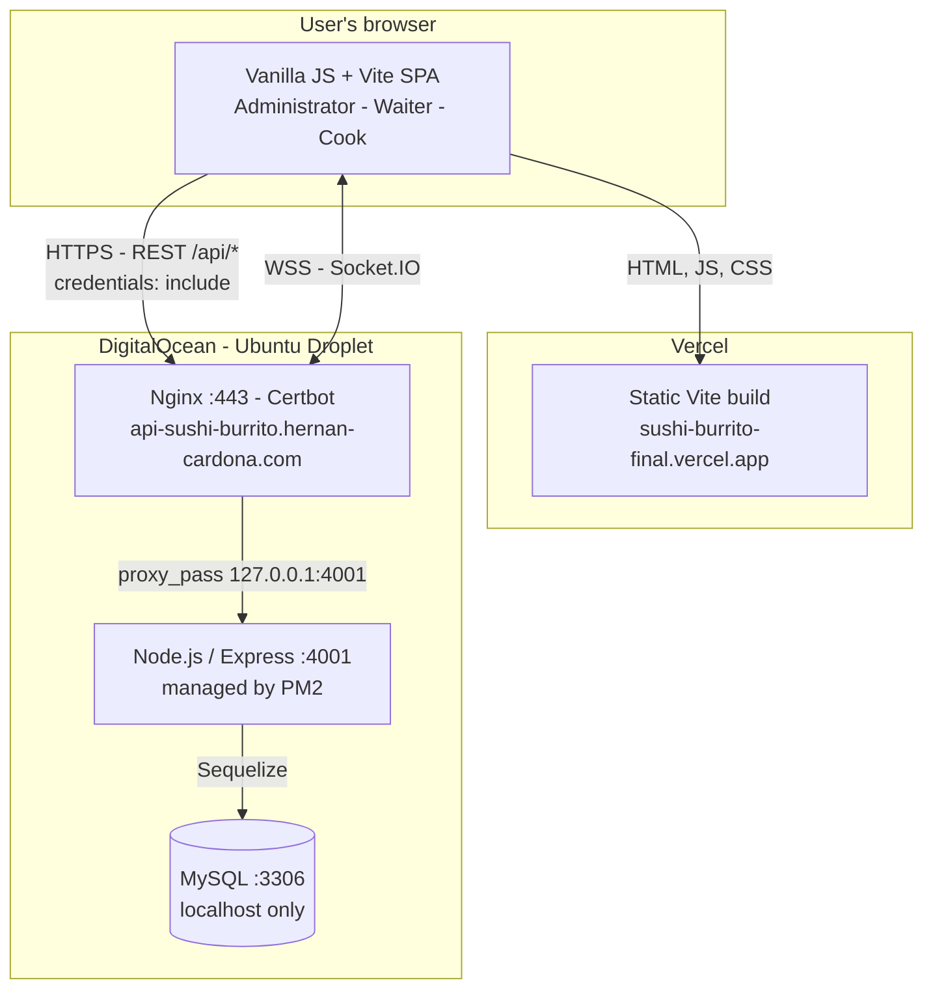

Management System for "Sushi Burrito" Restaurant
This repository contains the full source code for a restaurant management system (POS), designed to optimize the daily operations of "Sushi Burrito". The application is divided into a robust backend built with Node.js/Express and an interactive frontend built with Vanilla JavaScript and Vite.

🚀 Key Features
User Authentication and Roles: Secure login system with JWT (Access and Refresh Tokens) and role-based access control (Administrator, Waiter, Cook).

Menu Management (CRUD): Interface for administrators to create, read, update, and delete products and menu categories.

Table and Order Management: Complete workflow for waiters, from creating new orders at available tables to editing and tracking them.

Kitchen Interface: A "task board" view for kitchen staff to see pending orders, and mark them as "in preparation" and "ready".

Billing System: Generation of invoices from delivered orders, with tax and tip calculation. Includes the ability to void invoices for correction.

Reports and Statistics:

Administrative dashboard with key real-time metrics.

Statistics page with date filters to analyze revenue, best-selling products, and payment methods.

PDF report generation and email delivery.

🛠️ Tech Stack
Backend
Environment: Node.js

Framework: Express.js

Database: MySQL

ORM: Sequelize

Authentication: JSON Web Tokens (jsonwebtoken)

Security: bcryptjs for password hashing

Utilities: nodemailer for sending emails, pdfkit for PDF generation.

Frontend
Language: JavaScript (Vanilla JS, ES Modules)

Build Tool: Vite

Styling: CSS with Variables and modular architecture.

Notifications: SweetAlert2

---

## 🏗️ Architecture and Deployment

The application is deployed across two different providers: the **frontend** as a static site on **Vercel**, and the **backend together with the database** on a single **DigitalOcean droplet**.

| Component | Provider | Details |
| --- | --- | --- |
| Frontend (SPA) | **Vercel** | [`sushi-burrito-final.vercel.app`](https://sushi-burrito-final.vercel.app) — static Vite build served from the CDN, with HTTPS and automatic deployments from the main branch. |
| REST API + WebSocket | **DigitalOcean** (droplet) | [`api-sushi-burrito.hernan-cardona.com`](https://api-sushi-burrito.hernan-cardona.com) — Node.js/Express on internal port `4001`, behind Nginx (Let's Encrypt TLS via Certbot) and kept alive by PM2 as `sushi-burrito-api`. |
| Database | **DigitalOcean** (same droplet) | MySQL installed on the same machine, reachable only from `localhost`. It is not exposed to the internet. |

### Diagram



The Nginx vhost lives at `/etc/nginx/sites-enabled/api-sushi-burrito`: it listens on 443 with a Let's Encrypt certificate and does a `proxy_pass` to `http://localhost:4001`.

### Request flow

1. The browser downloads the SPA from Vercel's CDN.
2. The SPA calls the API using `VITE_API_URL`, which points to the backend's public domain.
3. Nginx terminates TLS on port 443 and does a `proxy_pass` to `127.0.0.1:4001`.
4. Express validates the JWT and queries MySQL on `localhost` through Sequelize.
5. Socket.IO keeps a WSS connection through that same Nginx, which must forward the `Upgrade` and `Connection` headers for the handshake to succeed.

Because the frontend and the API live on different domains, every call is **cross-origin**: the backend must include the Vercel origin in `FRONTEND_URL` so that CORS accepts credentialed requests.

### Production environment variables

On the **droplet** (`backend/.env`), the values that differ from local development:

```env
NODE_ENV=production
PORT=4001

DB_HOST=localhost
DB_PORT=3306

# Frontend origin on Vercel (comma-separated list is supported)
FRONTEND_URL=https://sushi-burrito-final.vercel.app
RESET_PASSWORD_URL=https://sushi-burrito-final.vercel.app/#/reset-password

# The refresh cookie travels over HTTPS only
REFRESH_COOKIE_SECURE=true
REFRESH_COOKIE_SAME_SITE=none
```

On **Vercel** (Project Settings -> Environment Variables):

```env
VITE_API_URL=https://api-sushi-burrito.hernan-cardona.com/api
VITE_SOCKET_URL=https://api-sushi-burrito.hernan-cardona.com
```

> **Why `REFRESH_COOKIE_SAME_SITE=none`:** the `vercel.app` domain is on the [Public Suffix List](https://publicsuffix.org/), so `sushi-burrito-final.vercel.app` is a registrable domain of its own, separate from `hernan-cardona.com`. Frontend and API are therefore *cross-site*, and the browser only attaches the `refreshToken` cookie on XHR requests when the value is `none` — which in turn requires `REFRESH_COOKIE_SECURE=true`. With `lax` the login still works, but silent renewal fails and the session drops once the access token expires after 15 minutes.

### Deploying the backend

The code lives at `/var/www/SushiBurritoFinal/backend` inside the droplet:

```bash
cd /var/www/SushiBurritoFinal/backend
git pull
npm install --omit=dev
pm2 restart sushi-burrito-api
pm2 logs sushi-burrito-api   # check that it started cleanly
```

To seed or repair the initial users, set the `SEED_*` variables described in `backend/.env.example` and run `npm run db:seed`.

---

⚙️ Installation and Setup
To get the project up and running, you will need to clone this repository and set up both the backend and the frontend separately.

Prerequisites
Node.js (version 18 or higher recommended)

NPM (usually installed with Node.js)

A running MySQL database server.

1. Backend Setup
Navigate to the backend folder:

cd backend

Install dependencies:

npm install

Set up global environment variables:

Create a copy of `backend/.env.example` and rename it to `backend/.env`.

Open `backend/.env` and fill in all variables with your credentials:

```env
# Server Configuration
NODE_ENV=development
PORT=3000

# Database Configuration
DB_HOST=localhost
DB_USER=your_mysql_user
DB_PASSWORD=your_mysql_password
DB_NAME=sushi_burrito_db

# JSON Web Token secrets (use random and secure values)
ACCESS_TOKEN_SECRET=your_super_secret_for_access_token
REFRESH_TOKEN_SECRET=your_other_super_secret_for_refresh_token
ACCESS_TOKEN_EXPIRES_IN=15m
REFRESH_TOKEN_EXPIRES_IN=7d
REFRESH_TOKEN_MAX_AGE_MS=604800000
REFRESH_COOKIE_NAME=refreshToken
REFRESH_COOKIE_SAME_SITE=lax
REFRESH_COOKIE_SECURE=false

# Frontend allowed for CORS (supports comma-separated origins)
FRONTEND_URL=http://localhost:5173
RESET_PASSWORD_URL=http://localhost:5173/#/reset-password

# Basic auth endpoint protection
AUTH_RATE_LIMIT_WINDOW_MS=900000
AUTH_RATE_LIMIT_MAX_REQUESTS=20

# Email configuration (e.g. Gmail)
EMAIL_SERVICE=gmail
EMAIL_USER=your_email@gmail.com
EMAIL_PASSWORD=your_gmail_app_password
```

Set up Frontend environment variables (Vite):

Create a copy of `Frontend/.env.example` and rename it to `Frontend/.env`.

Define:

```env
VITE_API_URL=http://localhost:3000/api
VITE_SOCKET_URL=http://localhost:3000
```

Create the database: Make sure to create a database in MySQL with the name you specified in `DB_NAME`.

Seed the database with initial data:

The src/seed.js file is set up to create the default roles and an administrator user.

Run the following command:

npm run db:seed

This will insert the roles and the first administrator user so you can log in.

2. Frontend Setup
Open a new terminal and navigate to the frontend folder:

cd frontend

Install dependencies:

npm install

▶️ Running the Application
You should have two terminals open, one for the backend and one for the frontend.

Start the Backend Server:

In the backend folder terminal, run:

npm run dev

The server will start on http://localhost:3000.

Start the Frontend Application:

In the frontend folder terminal, run:

npm run dev

The application will be available at http://localhost:5173.

Now you can open http://localhost:5173 in your browser and start using the application!

---

🧪 Testing

Backend:

```bash
npm test
```

Includes:
- 2 unit tests (`verifyToken` and `rate limiter`).
- 1 integration test (security headers + auth endpoint throttling).

Frontend:

```bash
npm test
```

Includes unit tests for auth helpers.

E2E:

```bash
npm run test:e2e
```

Includes 1 login E2E flow for administrator navigation to dashboard.
