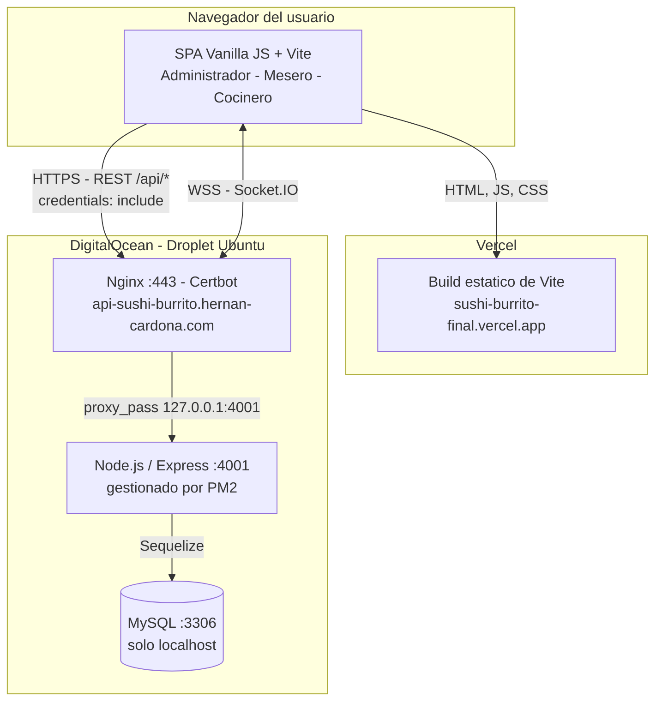

# Sistema de Gestión para Restaurante "Sushi Burrito"

Este repositorio contiene el código fuente completo para un sistema de gestión de restaurantes (POS), diseñado para optimizar las operaciones diarias de "Sushi Burrito". La aplicación está dividida en un backend robusto construido con Node.js/Express y un frontend interactivo construido con Vanilla JavaScript y Vite.

---

## 🚀 Características Principales

-   **Autenticación y Roles de Usuario:** Sistema de inicio de sesión seguro con JWT (Access y Refresh Tokens) y control de acceso basado en roles (Administrador, Mesero, Cocinero).
-   **Gestión de Menú (CRUD):** Interfaz para que los administradores puedan crear, leer, actualizar y eliminar productos y categorías del menú.
-   **Gestión de Mesas y Pedidos:** Flujo de trabajo completo para meseros, desde la creación de nuevos pedidos en mesas disponibles hasta la edición y seguimiento de los mismos.
-   **Interfaz para Cocina:** Vista de "tablero de tareas" para que el personal de cocina pueda ver los pedidos pendientes, marcarlos como "en preparación" y "listos".
-   **Sistema de Facturación:** Generación de facturas a partir de pedidos entregados, con cálculo de impuestos y propinas. Incluye la capacidad de anular facturas para corrección.
-   **Reportes y Estadísticas:**
    -   Dashboard administrativo con métricas clave en tiempo real.
    -   Página de estadísticas con filtros por fecha para analizar ingresos, productos más vendidos y métodos de pago.
    -   Generación de reportes en PDF y envío por correo electrónico.

---

## 🛠️ Stack Tecnológico

### Backend
-   **Entorno:** Node.js
-   **Framework:** Express.js
-   **Base de Datos:** MySQL
-   **ORM:** Sequelize
-   **Autenticación:** JSON Web Tokens (`jsonwebtoken`)
-   **Seguridad:** `bcryptjs` para el hasheo de contraseñas
-   **Utilidades:** `nodemailer` para envío de correos, `pdfkit` para generación de PDFs.

### Frontend
-   **Lenguaje:** JavaScript (Vanilla JS, ES Modules)
-   **Herramienta de Construcción:** Vite
-   **Estilos:** CSS con Variables y arquitectura modular.
-   **Notificaciones:** SweetAlert2

---

## 🏗️ Arquitectura y Despliegue

La aplicación se despliega en dos proveedores distintos: el **frontend** como sitio estático en **Vercel**, y el **backend junto con la base de datos** en un único **droplet de DigitalOcean**.

| Componente | Proveedor | Detalle |
| --- | --- | --- |
| Frontend (SPA) | **Vercel** | [`sushi-burrito-final.vercel.app`](https://sushi-burrito-final.vercel.app) — build estático de Vite servido por CDN, con HTTPS y despliegue automático desde la rama principal. |
| API REST + WebSocket | **DigitalOcean** (droplet) | [`api-sushi-burrito.hernan-cardona.com`](https://api-sushi-burrito.hernan-cardona.com) — Node.js/Express en el puerto interno `4001`, detrás de Nginx (TLS de Let's Encrypt vía Certbot) y mantenido vivo por PM2 como `sushi-burrito-api`. |
| Base de datos | **DigitalOcean** (mismo droplet) | MySQL instalado en la misma máquina, accesible únicamente desde `localhost`. No está expuesto a internet. |

### Diagrama



El vhost de Nginx vive en `/etc/nginx/sites-enabled/api-sushi-burrito`: escucha en 443 con certificado de Let's Encrypt y hace `proxy_pass` a `http://localhost:4001`.

### Flujo de una petición

1. El navegador descarga la SPA desde el CDN de Vercel.
2. La SPA llama a la API usando `VITE_API_URL`, que apunta al dominio público del backend.
3. Nginx termina TLS en el puerto 443 y hace `proxy_pass` a `127.0.0.1:4001`.
4. Express valida el JWT y consulta MySQL en `localhost` a través de Sequelize.
5. Socket.IO mantiene una conexión WSS por ese mismo Nginx, que debe reenviar las cabeceras `Upgrade` y `Connection` para que el handshake funcione.

Como el frontend y la API viven en dominios distintos, todas las llamadas son **cross-origin**: el backend debe incluir el origen de Vercel en `FRONTEND_URL` para que CORS acepte peticiones con credenciales.

### Variables de entorno en producción

En el **droplet** (`backend/.env`), los valores que cambian respecto al entorno local:

```env
NODE_ENV=production
PORT=4001

DB_HOST=localhost
DB_PORT=3306

# Origen del frontend en Vercel (acepta varios separados por coma)
FRONTEND_URL=https://sushi-burrito-final.vercel.app
RESET_PASSWORD_URL=https://sushi-burrito-final.vercel.app/#/reset-password

# La cookie de refresh solo viaja por HTTPS
REFRESH_COOKIE_SECURE=true
REFRESH_COOKIE_SAME_SITE=none
```

En **Vercel** (Project Settings -> Environment Variables):

```env
VITE_API_URL=https://api-sushi-burrito.hernan-cardona.com/api
VITE_SOCKET_URL=https://api-sushi-burrito.hernan-cardona.com
```

> **Por qué `REFRESH_COOKIE_SAME_SITE=none`:** el dominio `vercel.app` figura en la [Public Suffix List](https://publicsuffix.org/), así que `sushi-burrito-final.vercel.app` es un dominio registrable independiente de `hernan-cardona.com`. Frontend y API son, por tanto, *cross-site*, y el navegador solo adjunta la cookie `refreshToken` en las peticiones XHR si el valor es `none` — que a su vez exige `REFRESH_COOKIE_SECURE=true`. Con `lax` el login funciona igual, pero la renovación silenciosa falla y la sesión se cae al expirar el access token a los 15 minutos.

### Despliegue del backend

El código vive en `/var/www/SushiBurritoFinal/backend` dentro del droplet:

```bash
cd /var/www/SushiBurritoFinal/backend
git pull
npm install --omit=dev
pm2 restart sushi-burrito-api
pm2 logs sushi-burrito-api   # verifica el arranque
```

Para poblar o reparar los usuarios iniciales, define las variables `SEED_*` descritas en `backend/.env.example` y ejecuta `npm run db:seed`.

---

## ⚙️ Instalación y Configuración

Para poner en marcha el proyecto, necesitarás clonar este repositorio y configurar tanto el backend como el frontend por separado.

### Requisitos Previos
-   Node.js (versión 18 o superior recomendada)
-   NPM (generalmente se instala con Node.js)
-   Un servidor de base de datos MySQL en ejecución.

### 1. Configuración del Backend

1.  **Navega a la carpeta del backend:**
    ```bash
    cd backend
    ```

2.  **Instala las dependencias:**
    ```bash
    npm install
    ```

3.  **Configura las variables de entorno (globales):**
    -   Crea una copia del archivo `backend/.env.example` y renómbrala a `backend/.env`.
    -   Abre el archivo `backend/.env` y rellena todas las variables con tus credenciales:
        ```env
        # Configuración del Servidor
        NODE_ENV=development
        PORT=3000

        # Configuración de la Base de Datos
        DB_HOST=localhost
        DB_USER=tu_usuario_mysql
        DB_PASSWORD=tu_contraseña_mysql
        DB_NAME=sushi_burrito_db

        # Secretos para JSON Web Token (genera cadenas aleatorias y seguras)
        ACCESS_TOKEN_SECRET=tu_secreto_super_seguro_para_access_token
        REFRESH_TOKEN_SECRET=tu_otro_secreto_super_seguro_para_refresh_token
        ACCESS_TOKEN_EXPIRES_IN=15m
        REFRESH_TOKEN_EXPIRES_IN=7d
        REFRESH_TOKEN_MAX_AGE_MS=604800000
        REFRESH_COOKIE_NAME=refreshToken
        REFRESH_COOKIE_SAME_SITE=lax
        REFRESH_COOKIE_SECURE=false

        # Frontend permitido para CORS (acepta múltiples orígenes separados por coma)
        FRONTEND_URL=http://localhost:5173
        RESET_PASSWORD_URL=http://localhost:5173/#/reset-password

        # Rate limit de autenticación
        AUTH_RATE_LIMIT_WINDOW_MS=900000
        AUTH_RATE_LIMIT_MAX_REQUESTS=20

        # Configuración para envío de correos (ej. con Gmail)
        EMAIL_SERVICE=gmail
        EMAIL_USER=tu_correo@gmail.com
        EMAIL_PASSWORD=tu_contraseña_de_aplicacion_de_gmail
        ```

4.  **Configura variables de entorno del Frontend (Vite):**
    -   Crea una copia de `Frontend/.env.example` y renómbrala a `Frontend/.env`.
    -   Define:
        ```env
        VITE_API_URL=http://localhost:3000/api
        VITE_SOCKET_URL=http://localhost:3000
        ```

5.  **Crea la base de datos:** Asegúrate de crear una base de datos en MySQL con el nombre que especificaste en `DB_NAME`.

6.  **Puebla la base de datos con datos iniciales:**
    -   El archivo `src/seed.js` está preparado para crear los roles y un usuario administrador por defecto.
    -   Ejecuta el siguiente comando:
    ```bash
    npm run db:seed
    ```
    Esto insertará los roles y el primer usuario administrador para que puedas iniciar sesión.

### 2. Configuración del Frontend

1.  **Abre una nueva terminal y navega a la carpeta del frontend:**
    ```bash
    cd frontend
    ```

2.  **Instala las dependencias:**
    ```bash
    npm install
    ```

---

## ▶️ Ejecución de la Aplicación

Debes tener dos terminales abiertas, una para el backend y otra para el frontend.

1.  **Iniciar el Servidor Backend:**
    -   En la terminal de la carpeta `backend`, ejecuta:
    ```bash
    npm run dev
    ```
    -   El servidor se iniciará en `http://localhost:3000`.

2.  **Iniciar la Aplicación Frontend:**
    -   En la terminal de la carpeta `frontend`, ejecuta:
    ```bash
    npm run dev
    ```
    -   La aplicación estará disponible en `http://localhost:5173`.

¡Ahora puedes abrir `http://localhost:5173` en tu navegador y empezar a usar la aplicación!

---

## 🧪 Pruebas

### Backend
```bash
npm test
```

Incluye:
- 2 pruebas unitarias (`verifyToken` y `rate limiter`).
- 1 prueba de integración (cabeceras de seguridad + limitación en `/api/auth/login`).

### Frontend
```bash
npm test
```

Incluye pruebas unitarias de helpers de autenticación.

### E2E
```bash
npm run test:e2e
```

Prueba de login E2E del rol administrador con navegación a dashboard.

---
